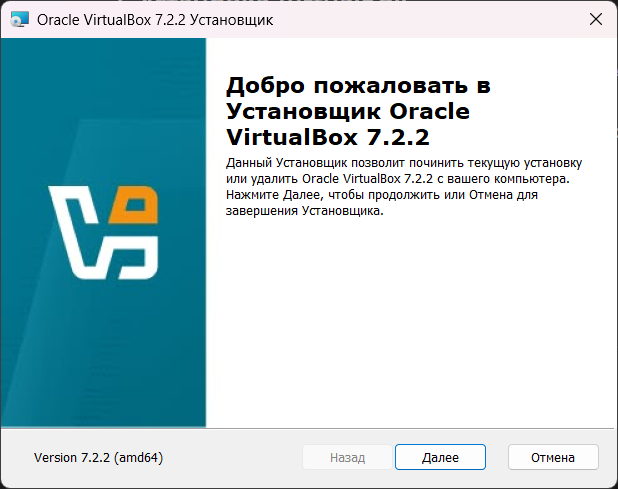
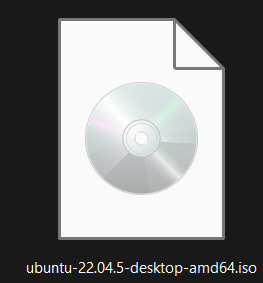
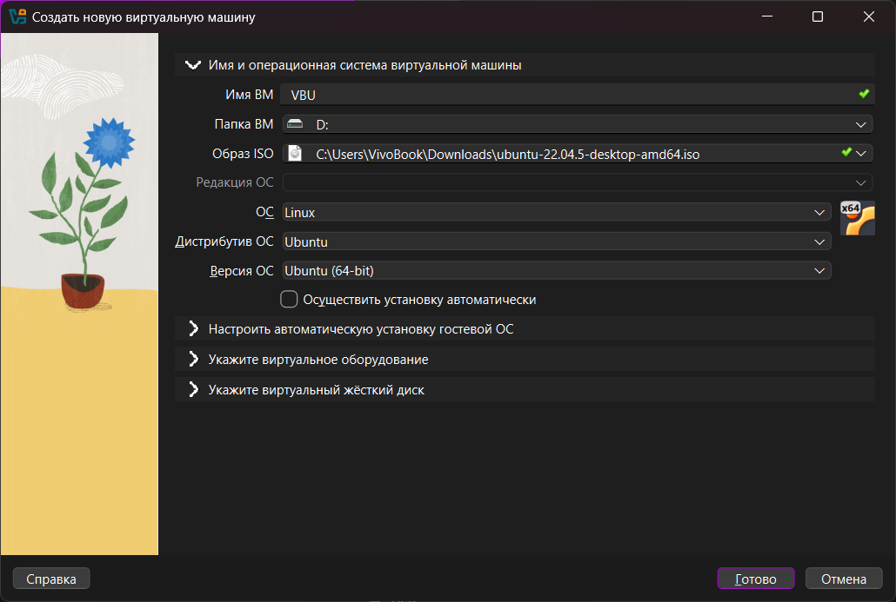
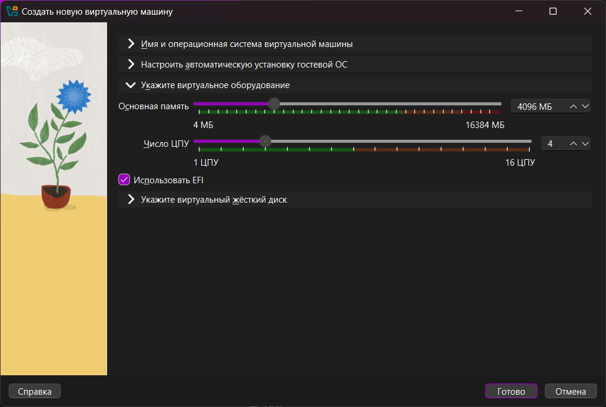
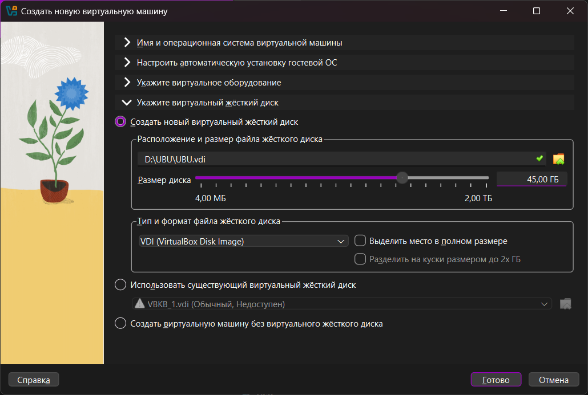
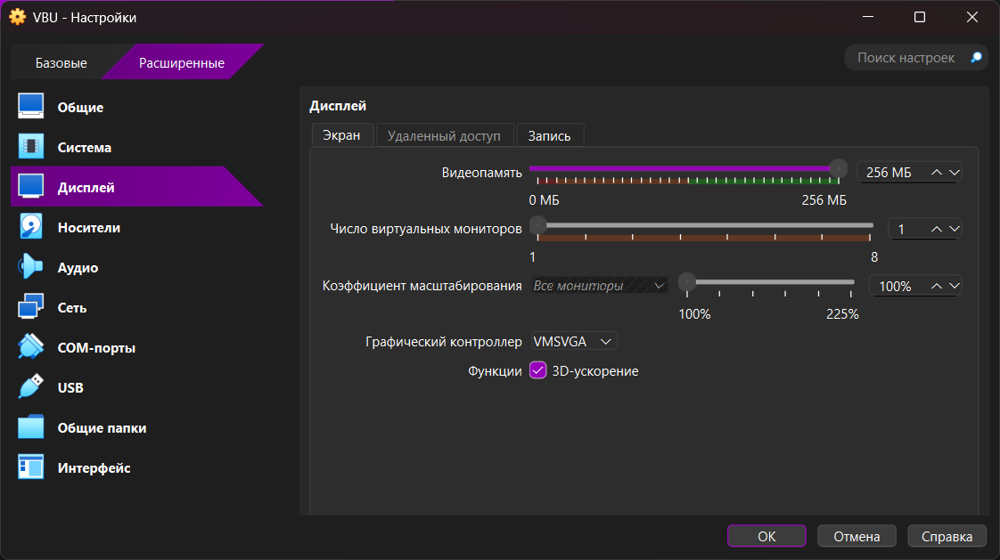
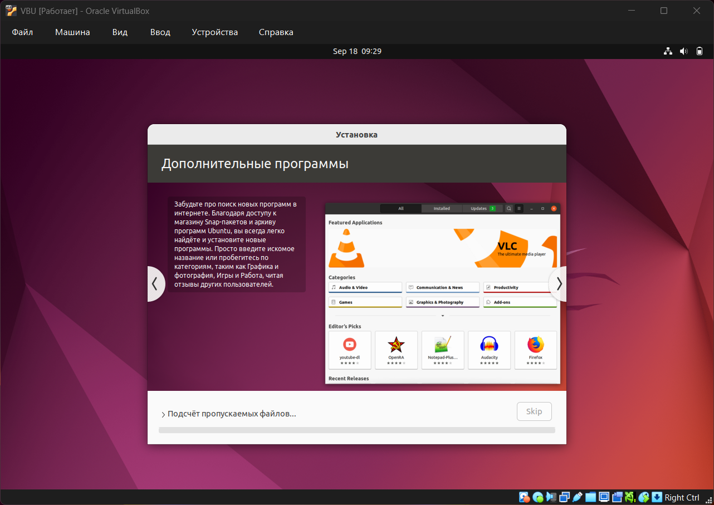
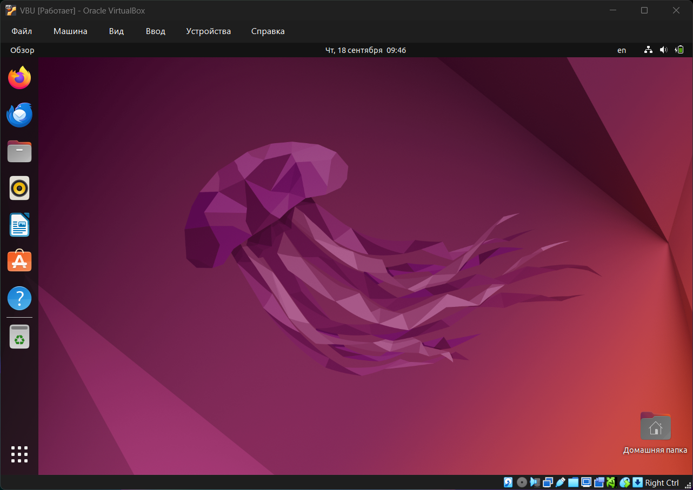
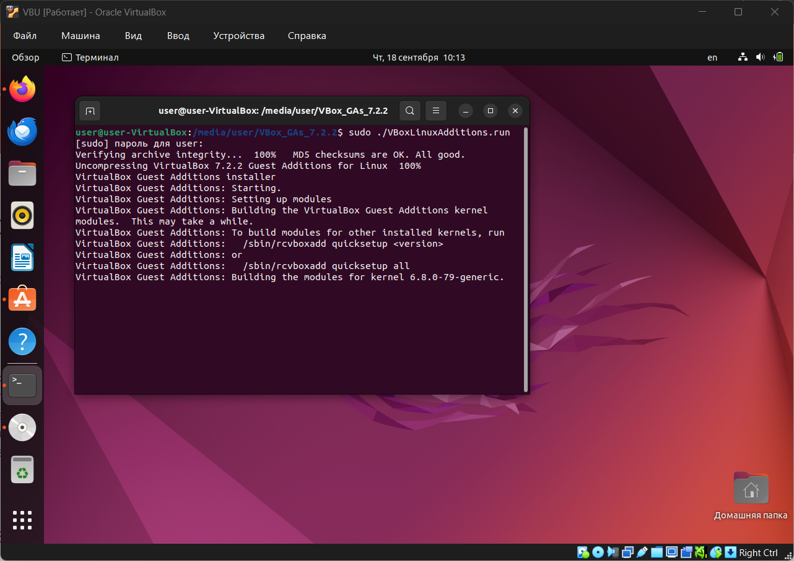

# Отчет по установке виртуальной машины и Ubuntu

## Тема

Установка и настройка операционной системы **Ubuntu** в виртуальной машине на Windows с использованием **VirtualBox**.

## Цель работы

Научиться устанавливать виртуальную машину и разворачивать на ней ОС Ubuntu для дальнейшей работы.

---

## Ход работы

### 1. Установка VirtualBox

- Перешел на сайт [https://www.virtualbox.org/wiki/Downloads](https://www.virtualbox.org/wiki/Downloads).
    
- Скачал установщик для Windows и выполнил установку.
    
- Настройки оставил по умолчанию.
    

 

---

### 2. Загрузка ISO-образа Ubuntu

- Перешел на сайт [https://ubuntu.com/download/desktop](https://ubuntu.com/download/desktop).
    
- Скачал образ Ubuntu 22.04.
    

 

---

### 3. Создание виртуальной машины

- В VirtualBox нажал «Создать».
    
- Указал имя, выбрал тип **Linux**, версия **Ubuntu (64-bit)**.
	
-  Подключил ISO-образ Ubuntu к виртуальному CD-приводу.
    
- Выделил 4 ГБ оперативной памяти.
	
- Выделил 4 процессорных ядра.
	
- Создал виртуальный диск 45 ГБ (динамически расширяемый).
	

 
 
 

---

### 4. Настройка виртуальной машины

- Видеопамять увеличил до 256 МБ.

 

---

### 5. Установка Ubuntu

- Запустил виртуальную машину.
    
- Выбрал «Установить Ubuntu».
    
- Настроил язык, часовой пояс, имя пользователя и пароль.
    
- В разделе установки диска выбрал «Стереть диск и установить Ubuntu».
    
- Дождался завершения установки и перезагрузил ВМ.
    

 
 

---

### 6. Установка Guest Additions

- Подключил образ Guest Additions через меню VirtualBox.
    
- В Ubuntu выполнил команды в терминале:
    
    ```bash
    sudo apt update 
    sudo apt install -y build-essential dkms linux-headers-$(uname -r) 
    cd /media/$USER/VBox_GAs_* 
    sudo ./VBoxLinuxAdditions.run 
    sudo reboot
    ```
    
- После перезагрузки заработала поддержка буфера обмена и автоизменение разрешения экрана.
    

 

---

## Результат работы

- Установил VirtualBox на Windows.
    
- Создал и настроил виртуальную машину.
    
- Успешно установил Ubuntu 22.04.
    
- Настроил интеграцию через Guest Additions.
    

---

## Вывод

В ходе работы я освоил процесс создания виртуальной машины в VirtualBox и установки на нее ОС Ubuntu. Теперь можно использовать виртуальную среду для дальнейших лабораторных и экспериментов.