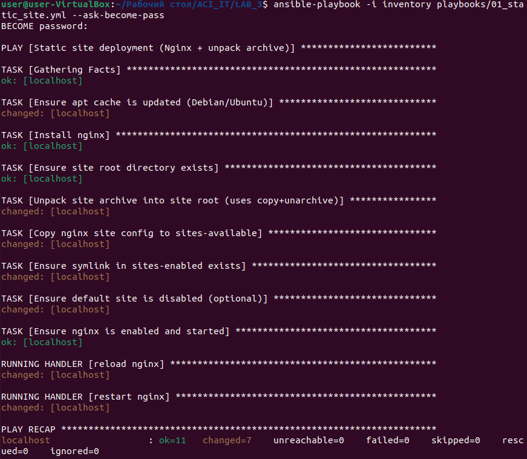
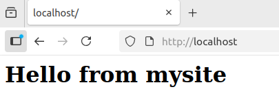
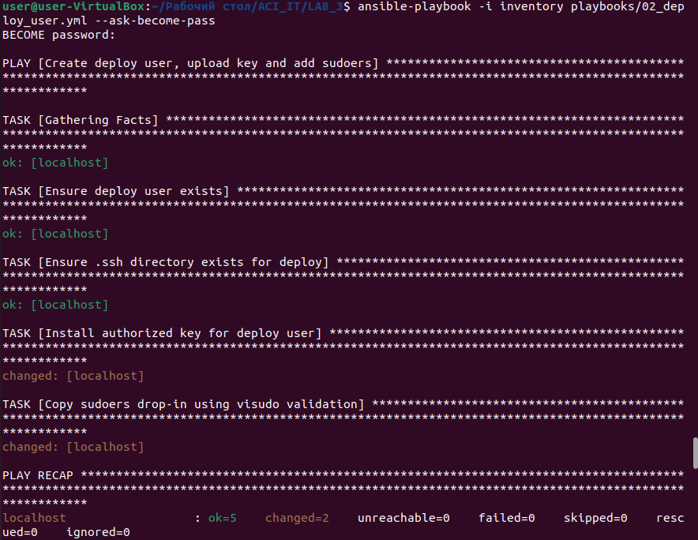
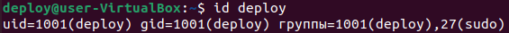
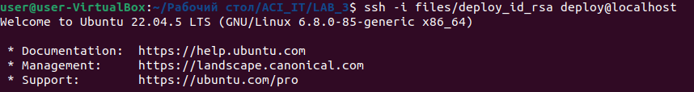
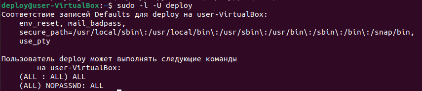

# Лабораторная работа №3

## Развёртывание статического сайта и настройка пользователя deploy через Ansible

**Цели работы:**

1. Освоить работу с Ansible для установки и настройки веб-сервера Nginx, развертывания статического сайта.
    
2. Создать пользователя для деплоя с SSH-доступом и правами sudo без пароля.
    

---

# Часть 1. Плейбук 1 — «Статический сайт через Nginx + распаковка архива»

**Цель:**

- Установить Nginx, создать корневой каталог сайта, развернуть архив с сайтом и настроить виртуальный хост.
    

---

## 1. Подготовка

1. Убедилcя, что Ansible установлен и настроен локальный inventory:
    

```ini
[targets]
localhost ansible_connection=local
```

---

## 2. Плейбук `01_static_site.yml`

```yaml
---
- name: Static site deployment (Nginx + unpack archive)
  hosts: web
  become: true
  vars:
    site_root: /var/www/mysite
    site_archive: "../files/site.tar.gz"   # путь относительно каталога playbook
    nginx_site_conf: "../files/mysite.conf"
    nginx_available: /etc/nginx/sites-available
    nginx_enabled: /etc/nginx/sites-enabled

  handlers:
    - name: reload nginx
      service:
        name: nginx
        state: reloaded

    - name: restart nginx
      service:
        name: nginx
        state: restarted

  tasks:
    - name: Ensure apt cache is updated (Debian/Ubuntu)
      apt:
        update_cache: yes
      when: ansible_os_family == "Debian"

    - name: Install nginx
      apt:
        name: nginx
        state: present
      when: ansible_os_family == "Debian"

    - name: Ensure site root directory exists
      file:
        path: "{{ site_root }}"
        state: directory
        owner: www-data
        group: www-data
        mode: '0755'

    - name: Unpack site archive into site root (uses copy+unarchive)
      unarchive:
        src: "{{ site_archive }}"
        dest: "{{ site_root }}"
        remote_src: no     # file is on control machine in files/
        owner: www-data
        group: www-data
        mode: '0644'
      notify: reload nginx

    - name: Copy nginx site config to sites-available
      copy:
        src: "{{ nginx_site_conf }}"
        dest: "{{ nginx_available }}/mysite.conf"
        owner: root
        group: root
        mode: '0644'
        backup: yes
      notify: restart nginx

    - name: Ensure symlink in sites-enabled exists
      file:
        src: "{{ nginx_available }}/mysite.conf"
        dest: "{{ nginx_enabled }}/mysite.conf"
        state: link
        force: yes
      notify: restart nginx

    - name: Ensure default site is disabled (optional)
      file:
        path: /etc/nginx/sites-enabled/default
        state: absent
      notify: restart nginx

    - name: Ensure nginx is enabled and started
      service:
        name: nginx
        state: started
        enabled: yes

```

---

## 3. Запуск плейбука

```bash
ansible-playbook -i inventory playbooks/01_static_site.yml --ask-become-pass
```



---

## 4. Проверка работы

- Проверил, что сервис Nginx запущен:
    

```bash
sudo systemctl status nginx
```

- Проверил доступ через браузер:
    

```
http://localhost
```

- Страница с сайтом открывается корректно.
    



---

# Часть 2. Плейбук 2 — «Пользователь деплоя + SSH-ключ + sudoers drop-in»

**Цель:**

- Создать пользователя deploy с домашним каталогом, доступом по SSH через ключ и правами `sudo` без пароля.
    

---

## 1. Плейбук `02_deploy_user.yml`

```yaml
---
- name: Create deploy user, upload key and add sudoers
  hosts: web
  become: true
  vars:
    deploy_user: deploy
    deploy_group: sudo
    deploy_pubkey_src: "files/deploy_id_rsa.pub"
    sudoers_dropin: /etc/sudoers.d/deploy

  tasks:
    - name: Ensure deploy user exists
      user:
        name: "{{ deploy_user }}"
        groups: "{{ deploy_group }}"
        append: yes
        shell: /bin/bash
        create_home: yes

    - name: Ensure .ssh directory exists for deploy
      file:
        path: "/home/{{ deploy_user }}/.ssh"
        state: directory
        owner: "{{ deploy_user }}"
        group: "{{ deploy_user }}"
        mode: '0700'

    - name: Install authorized key for deploy user
      authorized_key:
        user: "{{ deploy_user }}"
        state: present
        key: "{{ lookup('file', deploy_pubkey_src) }}"

    - name: Copy sudoers drop-in using visudo validation
      copy:
        content: "{{ deploy_user }} ALL=(ALL) NOPASSWD:ALL\n"
        dest: "{{ sudoers_dropin }}"
        owner: root
        group: root
        mode: '0440'
        validate: '/usr/sbin/visudo -cf %s'
```

---

## 2. Запуск плейбука

```bash
ansible-playbook -i inventory playbooks/02_deploy_user.yml --ask-become-pass
```



---

## 3. Проверка пользователя

```bash
id deploy
```

**Вывод:**

```
uid=1001(deploy) gid=1001(deploy) группы=1001(deploy),27(sudo)
```

- Пользователь создан, входит в группу `sudo`.
    



---

## 4. Проверка SSH-доступа

1. Генерация ключей:
    

```bash
ssh-keygen -t rsa -b 4096 -f files/deploy_id_rsa -N ""
```

2. Копирование публичного ключа:
    

```bash
sudo cp files/deploy_id_rsa.pub /home/deploy/.ssh/authorized_keys
sudo chown deploy:deploy /home/deploy/.ssh/authorized_keys
sudo chmod 600 /home/deploy/.ssh/authorized_keys
```

3. Подключение по ключу:
    

```bash
ssh -i files/deploy_id_rsa deploy@localhost
```

**Вывод:**

```
Welcome to Ubuntu 22.04.5 LTS
```



---

## 5. Проверка sudo

```bash
sudo -l -U deploy
```

**Вывод:**

```
deploy ALL=(ALL) NOPASSWD: ALL
```



---

## 6. Итог

Плейбук 1:

- Установил Nginx.
    
- Создал каталог сайта `/var/www/mysite`.
    
- Развернул архив `site.tar.gz`.
    
- Настроил виртуальный хост и включил его.
    

Плейбук 2:

- Создал пользователя deploy.
    
- Настроил SSH-доступ через ключ.
    
- Настроил `sudo` без пароля.
    
- Проверка показала, что доступ по ключу работает, права `sudo` подтверждены.
    